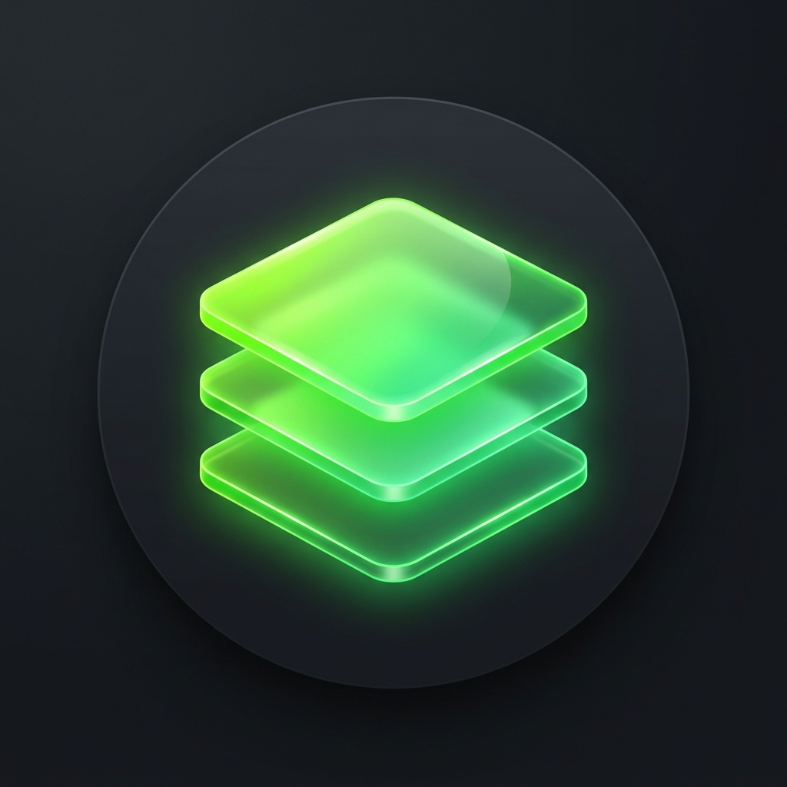

# Agente Helpdesk Pro

<div align="center">
  
  <h3>Agente Helpdesk Pro — COPPEAD/UFRJ</h3>
  <p>Suporte técnico inteligente com inventário automático e acesso remoto seguro</p>
</div>

---

## 📋 Visão Geral

O **Agente Helpdesk Pro** é uma aplicação desktop para Windows desenvolvida para o Setor de TI do COPPEAD/UFRJ. Ela integra o GLPI (abertura de chamados), coleta automática de inventário de hardware/software e acesso remoto criptografado via MeshCentral.

## ✨ Funcionalidades

| Funcionalidade | Descrição |
|---|---|
| 🎫 **Abrir Chamados** | Interface simplificada para criar chamados no GLPI |
| 📊 **Inventário Automático** | Coleta e sincroniza hardware/software com o GLPI |
| 🖥️ **Acesso Remoto** | Suporte remoto criptografado via MeshCentral (LGPD compliant) |
| 🔔 **Notificações** | Alertas sobre chamados e atualizações em tempo real |
| 📈 **Telemetria** | Diagnóstico técnico do dispositivo |
| 🌙 **Tema Escuro/Claro** | Interface moderna adaptável |

## 🖥️ Requisitos do Sistema

- **Sistema Operacional:** Windows 10 (64-bit) ou superior
- **Processador:** x64 (Intel ou AMD)
- **RAM:** 4GB mínimo
- **Disco:** 500MB livre
- **Rede:** Acesso à intranet COPPEAD (chamados.intranet.coppead.ufrj.br)
- **Privilégios:** Administrador local (para instalação)

## 🚀 Instalação

### Para usuários finais

1. Baixe o instalador `AgentHelpdeskPro-Setup-1.0.0.exe` disponibilizado pelo Setor de TI
2. Execute o instalador **como Administrador** (clique direito → "Executar como administrador")
3. Siga as instruções na tela
4. O agente inicia automaticamente após a instalação

### Para administradores de TI (silencioso)

```powershell
# Instalação silenciosa — ideal para GPO ou SCCM
AgentHelpdeskPro-Setup-1.0.0.exe /S
```

## 🛠️ Desenvolvimento

### Pré-requisitos

```bash
node >= 18
npm >= 9
```

### Instalação das dependências

```bash
npm install
```

### Executar em modo de desenvolvimento

```bash
npm start
```

### Gerar instalador

```bash
# Instalador NSIS (.exe)
npm run dist

# Versão portátil
npm run dist:portable

# Ambos
npm run dist:all
```

O instalador será gerado em `dist/`.

## 📁 Estrutura do Projeto

```
agente-helpdesk-pro/
├── assets/               # Executáveis e ícones
│   ├── meshagent64.exe   # MeshAgent COPPEAD (acesso remoto)
│   └── icon.ico / icon.png
├── build/                # Recursos do instalador NSIS
│   └── installer.nsh     # Script NSIS customizado
├── certs/                # Certificados SSL da intranet
├── src/
│   ├── main.js           # Entry point Electron (Main Process)
│   ├── preload.js        # Bridge segura Main↔Renderer
│   ├── main/
│   │   ├── services/     # mesh-runner, scheduler, etc.
│   │   ├── ipc/          # Handlers IPC (tickets, mesh, etc.)
│   │   ├── glpi-api.js   # Integração com GLPI REST API
│   │   ├── logger.js     # Sistema de logs centralizado
│   │   └── update-manager.js
│   └── renderer/         # Frontend (HTML/CSS/JS)
│       ├── index.html
│       ├── css/
│       └── js/
└── dist/                 # Saída dos instaladores (gerado)
```

## 🔒 Segurança e LGPD

- O acesso remoto só é iniciado **com consentimento explícito do usuário** (checklist de 4 itens)
- Toda comunicação é criptografada via TLS/WebSocket seguro
- Nenhum dado é enviado sem autorização do usuário
- O usuário pode encerrar a sessão remota a qualquer momento

## 📞 Suporte

**Setor de TI — COPPEAD/UFRJ**  
📧 ti@coppead.ufrj.br  
🌐 https://chamados.intranet.coppead.ufrj.br

---

<div align="center">
  <sub>Desenvolvido com ❤️ pelo Setor de TI do COPPEAD/UFRJ</sub>
</div>
